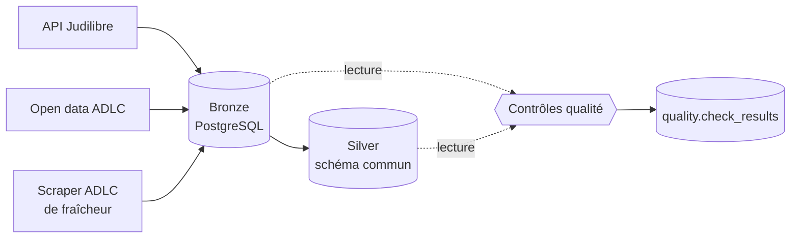

# legal-data-pipeline


Mini-pipeline de données juridiques : collecte multi-sources (API, open data, scraping), structuration et contrôle qualité.



## En bref
- **3 sources** : l'API Judilibre, l'open data et le site de l'Autorité de la concurrence.
- **6707 décisions** dans la couche Silver : 6683 de l'Autorité de la concurrence, 24 de Judilibre.
- **10 contrôles qualité** sur 5 dimensions (complétude, validité, unicité, cohérence, fraîcheur), résultats historisés.
- **168 tests**, sans appel réseau, lancés par la CI à chaque pull request.

> [!IMPORTANT]
> **Pourquoi ne pas tout automatiser ?**
> J'aurais pu confier l'ensemble du projet à Claude Code, en lui faisant rédiger un plan d'implémentation (par exemple avec les skills Superpowers) puis l'exécuter de bout en bout. J'ai fait le choix inverse : **garder la main sur chaque étape**, pour comprendre ce qui est construit, prendre moi-même les décisions liées aux sources et pouvoir expliquer chaque ligne de code. La délégation à un agent vient ensuite, progressivement, sur des tâches dont je maîtrise le contexte et que je sais vérifier.
>
> **Ce que cette approche a permis de trouver :**
> - la route `/export` de l'API Judilibre était **dépréciée**, alors que rien ne le signalait à l'exécution ;
> - la valeur par défaut de `date_type` **changeait silencieusement** entre `/export` et `/scan` : sur une même période, seules 6 décisions étaient communes aux deux routes ;
> - une décision peut être **modifiée sans que sa date de mise à jour change**, ce que seule la comparaison des empreintes a détecté ;
> - pour la couche Silver, **96 tests passaient, mais le premier run réel a révélé 6683 anomalies** : la spécification décrivait comme du texte des champs qui sont de vraies listes JSON. Vérifié avec `jsonb_typeof`, corrigé, et testé depuis sur de vraies décisions du Bronze ;
> - pour les contrôles qualité, une première version du contrôle de cohérence entre numéro et date levait **42 alertes, dont 39 fausses** : en examinant les décisions une par une, j'ai identifié une règle de la source (la numérotation d'une année se prolonge sur les premiers mois de la suivante) et isolé **les 3 vraies incohérences**.

## Objectif
- **Bronze** : collecter des décisions de justice et d'autorités administratives, stockées brutes dans PostgreSQL :
  - API Judilibre (Cour de cassation) ;
  - jeu de données open data de l'Autorité de la concurrence (data.gouv.fr) ;
  - scraper du site de l'Autorité de la concurrence, pour détecter les décisions pas encore publiées en open data.
- **Silver** : ramener les décisions de Judilibre et de l'open data à un schéma commun.
- **Qualité** : mesurer l'écart entre ce qui est collecté et ce qui est exploitable.
- **Bonus** : planification avec Celery, indexation Elasticsearch, API de recherche FastAPI.

## Avancement
- [x] Étape 1a : collecteur Judilibre (pagination, reprises sur erreur, collecte incrémentale, journal des runs), testé sur données réelles ; idempotence vérifiée (relance d'un run : 0 nouveau, 14 inchangés)
- [x] Industrialisation : CI GitHub Actions (ruff + pytest), pre-commit, Dependabot, branche `main` protégée
- [x] Migration de `/export` (déprécié) vers `/scan`, avec `date_type` explicite
- [x] Étape 1b : ingestion du jeu de données open data de l'Autorité de la concurrence (6683 décisions, lecture en flux d'un JSON de 210 Mo, idempotence vérifiée)
- [x] Étape 1c : scraper de fraîcheur du site de l'Autorité de la concurrence (première page de la liste, contrôle des écarts avec l'open data), réalisé par délégation à un agent
- [x] Étape 2 : couche Silver (schéma commun Judilibre et Autorité de la concurrence, reconstruction complète à chaque run, 6707 décisions, aucune anomalie), réalisée par délégation à un agent
- [x] Étape 3 : contrôles qualité (9 contrôles sur 5 dimensions, résultats historisés, écarts connus distingués des nouveaux) ; catalogue de requêtes écrit par moi, moteur réalisé par délégation à un agent
- [ ] Étape 4 : planification du pipeline avec Celery et Redis (Celery Beat)
- [ ] Étape 5 : Elasticsearch et API de recherche FastAPI

## Lancer le projet
```bash
cp .env.example .env            # puis renseigner JUDILIBRE_API_KEY
docker compose up -d            # ou : podman compose up -d
pip install -r requirements-dev.txt
pre-commit install
pytest
python -m src.collector.judilibre.run --start 2026-09-01 --end 2026-09-07
python -m src.collector.adlc_opendata.run                 # fichier local : data/raw/adlc-texte-complet-publications.json
python -m src.collector.adlc_opendata.run --url <URL>     # ou téléchargement préalable depuis data.gouv.fr
python -m src.collector.adlc_scraper.run                  # contrôle de fraîcheur : décisions du site absentes de l'open data
python -m src.silver.run                                  # reconstruction complète de silver.decisions depuis Bronze
python -m src.quality.run                                 # contrôles qualité ; code de sortie 1 si un contrôle bloquant échoue
python -m src.search.run                                  # reconstruction de l'index decisions ; code de sortie 1 si l'alias n'est pas basculé
```

Les scripts de `sql/` ne sont exécutés qu'à la création du volume PostgreSQL. Sur une base existante, appliquer à la main les migrations Silver, qualité et recherche (PowerShell) :
```powershell
Get-Content sql\003_silver.sql | podman exec -i legal-data-pipeline-postgres-1 psql -U legal -d legal
Get-Content sql\004_quality.sql | podman exec -i legal-data-pipeline-postgres-1 psql -U legal -d legal
Get-Content sql\005_search.sql | podman exec -i legal-data-pipeline-postgres-1 psql -U legal -d legal
Get-Content sql\006_findability.sql | podman exec -i legal-data-pipeline-postgres-1 psql -U legal -d legal
```

Sous Windows, utiliser `127.0.0.1` plutôt que `localhost` dans `DATABASE_URL` et `ELASTICSEARCH_URL` : `localhost` est d'abord résolu en IPv6 (`::1`), et la connexion au conteneur peut alors prendre plus de deux minutes avant de se rabattre sur l'IPv4.

Le dossier `data/` est ignoré par Git : les fichiers sources sont téléchargés, jamais versionnés.

Options du collecteur Judilibre : `--date-type update|creation` (défaut : `update`), `--batch-size` (défaut : 100). Sans `--start`, la collecte reprend après le dernier run réussi du même type de date.

## Structure du projet
```text
src/
├── collector/                # un collecteur par source, chacun avec son point d'entrée run.py
│   ├── judilibre/            # client de l'API Judilibre (pagination /scan, reprises sur erreur) et collecte incrémentale
│   ├── adlc_opendata/        # téléchargement et lecture en flux du JSON open data de l'Autorité de la concurrence
│   └── adlc_scraper/         # client HTTP, parseurs HTML de la liste des décisions et contrôle des écarts avec l'open data
├── storage/
│   └── bronze_store.py       # écriture dans Bronze (empreinte du contenu, idempotence) et journal des runs
├── silver/
│   ├── common.py             # schéma commun (SilverRow) et conversions partagées (dates, listes)
│   ├── judilibre.py          # transformation d'une décision Judilibre
│   ├── adlc_opendata.py      # transformation d'une décision de l'open data de l'Autorité
│   └── run.py                # reconstruction complète de silver.decisions et comptage des anomalies
├── quality/
│   ├── checks.yml            # catalogue des contrôles : requêtes SQL, attentes par source, sévérité
│   ├── checks.py             # chargement et validation du catalogue
│   ├── evaluate.py           # comparaison des résultats aux attentes, statuts et verdict
│   └── run.py                # exécution en lecture seule, historisation dans quality.check_results
└── search/
    ├── mapping.json          # mapping de l'index : champs, analyseur français, normaliseur des numéros
    ├── document.py           # construction d'un document à partir d'une ligne Silver
    ├── index.py              # accès à Elasticsearch (création, envoi en masse, comptes, alias)
    ├── rebuild.py            # reconstruction d'un index et bascule de l'alias si les comptes concordent
    ├── run.py                # lecture de Silver, statistiques dans search.index_stats, rapport
    ├── query.py              # requêtes par numéro et par titre, partagées avec la future API
    ├── findability.py        # échantillon, ambiguïtés, rangs, métriques et rapport de l'évaluation
    └── evaluate.py           # évaluation de la findability, résultats dans search.findability_*
sql/
├── 001_bronze.sql            # schéma bronze : documents bruts et journal des runs
├── 002_add_date_type.sql     # type de date filtré (update | creation) dans le journal des runs
├── 003_silver.sql            # schéma silver : table decisions
├── 004_quality.sql           # schéma quality : table check_results
├── 005_search.sql            # schéma search : table index_stats
└── 006_findability.sql       # schéma search : tables findability_runs et findability_results
tests/
├── fixtures/                 # page HTML et extrait JSON, pour tester sans appel réseau
└── test_*.py                 # un fichier par module (collecteurs, Silver, qualité, recherche)
docs/
├── api/                      # copie de référence de la spécification OpenAPI de Judilibre
├── sources/                  # analyse des sources (structure des données, écarts constatés)
└── tasks/                    # spécifications des tâches déléguées à un agent
```

## Couche Silver
Une seule table, `silver.decisions`, alimentée par Judilibre et l'open data de l'Autorité de la concurrence (le scraper reste un outil de contrôle, hors Silver) :
- un **tronc commun** : numéro, émetteur, type, date, titre, texte intégral, secteurs, URL ;
- une colonne **`attributes`** (JSON) pour les champs propres à chaque source.

Règles de transformation :
- **reconstruction complète** à chaque run, dans une seule transaction : en cas d'échec, l'ancien contenu reste intact ;
- **ne jamais deviner** : une valeur non convertible devient `NULL` et est comptée comme anomalie, par type ; une valeur inconnue n'est jamais rattachée à un type connu ;
- **un champ absent n'est pas une anomalie** : les deux familles de décisions de l'Autorité n'ont pas les mêmes champs ;
- **pas de dédoublonnage** en Silver : les doublons restent visibles pour l'étape des contrôles qualité.

Le run est journalisé dans `bronze.collection_runs` (source `silver`). Spécification et plan : [`docs/tasks/`](docs/tasks/).

## Contrôles qualité
Chaque contrôle est une requête SQL associée à une attente, déclarée dans [`src/quality/checks.yml`](src/quality/checks.yml). Je tiens ce catalogue moi-même (requêtes et seuils) ; le moteur (`src/quality/`) se contente de les exécuter.

- Chaque requête renvoie une ligne par source, avec deux colonnes : `source` et `value`.
- Les attentes (`==`, `<=`, `>=`, `<`, `>`) sont données par source, avec une entrée `default` facultative. Un **écart connu et documenté** a sa propre attente (par exemple 30 textes vides pour l'Autorité) : il ne déclenche pas d'alerte, alors qu'un nouvel écart ressort.
- Statuts d'un résultat :
  - `pass` / `fail` : la valeur respecte ou non l'attente ;
  - `no_data` : une source déclarée dans l'attente est absente du résultat ;
  - `unchecked` : aucune attente ne s'applique à la source (signalé, jamais bloquant) ;
  - `query_error` : la requête a échoué ou son résultat est mal formé ; les autres contrôles s'exécutent quand même.
- **Verdict** : le run échoue si un contrôle de sévérité `error` est en `fail`, `no_data` ou `query_error`. Le script sort alors avec le code 1 (0 sinon), pour que Celery ou la CI puissent arrêter le pipeline. Un contrôle `warning` n'est jamais bloquant.

Les requêtes s'exécutent dans une transaction en lecture seule, avec un savepoint par contrôle. Les résultats sont ensuite stockés dans `quality.check_results` (une ligne par contrôle et par source, avec le message d'erreur d'un `query_error`), pour suivre la qualité dans le temps. Le run est journalisé dans `bronze.collection_runs` (source `quality`) : son statut est `success` dès que le moteur a tout exécuté, quel que soit le verdict.

L'option `--checks <chemin>` permet de lancer un autre catalogue, par exemple un catalogue de test avec une requête volontairement cassée.

**Premier run (25/09/2026)** : 9 contrôles, 18 résultats, tous `pass`. Écarts connus, acceptés à leur niveau actuel : 30 décisions de l'Autorité sans texte intégral, 5 numéros en double, 3 dates impossibles au regard du numéro, et le type de décision vide pour toutes les décisions de Judilibre.

## Recherche
Les décisions de Silver sont indexées dans Elasticsearch (service `elasticsearch` du `docker-compose.yml`, un seul nœud, sécurité désactivée : usage local uniquement). Le mapping, dans [`src/search/mapping.json`](src/search/mapping.json), est strict : un champ non déclaré fait rejeter le document.

- **Reconstruction complète** à chaque run, dans un nouvel index `decisions_<AAAAMMJJ_HHMMSS>` (heure UTC). Un document par ligne Silver, d'identifiant `source|external_id` ; une valeur `NULL` reste `null`, et `has_text` indique si le texte intégral est présent.
- **Bascule atomique** : l'alias `decisions`, seul nom interrogé, passe au nouvel index en une seule opération, **uniquement si** les comptes par source sont identiques à ceux de Silver et qu'aucun document n'a été rejeté. Silver est compté et lu sur un même instantané, en lecture seule.
- **En cas d'écart ou d'erreur**, le nouvel index est supprimé et l'alias reste sur l'ancien : la recherche ne voit jamais un index incomplet.
- **Retour arrière** : après la bascule, l'index précédent est conservé et les plus anciens sont supprimés. Un échec de ce nettoyage est signalé par un avertissement, sans changer le code de sortie.

Chaque run écrit dans `search.index_stats` une ligne par source (compte Silver, compte indexé, rejets, bascule ou non), même quand l'alias n'est pas basculé. Il est journalisé dans `bronze.collection_runs` (source `search`) : statut `failed`, avec la raison dans `error`, si l'alias n'est pas basculé. Le script sort alors avec le code 1 (0 sinon).

### Évaluation de la findability
`python -m src.search.evaluate [--title-boost 1 2 3]` mesure si les décisions de Silver se retrouvent dans l'index, sur un échantillon reproductible. Spécification : [`docs/tasks/index-quality.md`](docs/tasks/index-quality.md).

- **Échantillon** : 200 décisions de l'Autorité tirées par `md5(external_id)`, plus toutes celles sans texte intégral, toutes celles dont le numéro est partagé et toutes les décisions de Judilibre.
- **Deux modes**, via l'alias `decisions`, dans le top 10 :
  - `number` : recherche exacte sur le numéro, pour toutes les décisions de l'échantillon ;
  - `title` : le titre de la décision comme texte de recherche, sur le titre pondéré (`--title-boost`, 3 par défaut, décimales acceptées) et le texte intégral ; décisions de l'Autorité seulement (Judilibre n'a pas de titre). La requête est celle de [`src/search/query.py`](src/search/query.py), que l'API de recherche reprendra.
- **Métriques** : hit@1, hit@10 et MRR (moyenne de 1/rang, 0 hors du top 10), au total et par groupe : texte présent ou non, titre ambigu ou non, numéro ambigu ou non. Un titre est ambigu s'il appartient à plusieurs décisions de Silver (espaces autour ignorés, apostrophes `’` et `'` confondues comme à l'indexation) ; un numéro, s'il est partagé (casse ignorée, comme le normaliseur de l'index). Un groupe vide n'a pas de métriques (`NULL` en base, « - » dans le rapport).
- **Stockage** : une ligne par mode et par poids du titre dans `search.findability_runs`, une ligne par décision cherchée (rang, `NULL` hors du top 10, et nombre de résultats) dans `search.findability_results`.
- **Rapport** : métriques par mode, poids et groupe, puis les décisions absentes du top 10 par numéro et par titre, avec leur rang pour chaque poids.

Le run est journalisé dans `bronze.collection_runs` (source `search-eval`). Il échoue si l'alias `decisions` est absent, ou s'il bascule vers un autre index pendant l'évaluation (les résultats mélangeraient deux index). Sinon, le script sort avec le code 0 : les seuils relèvent des contrôles qualité.

## Méthode de travail
Le projet est développé avec l'aide de l'IA générative, selon deux modes :

- **Assistance conversationnelle (Claude)** : explications, discussions de conception, premières versions de code (dont les requêtes SQL des contrôles qualité) que je relis, teste sur les données réelles et adapte.
- **Délégation à un agent (Claude Code)**, par exemple pour le scraper de fraîcheur ([PR #18](https://github.com/Maeva-RODRIGUES/legal-data-pipeline/pull/18)), la couche Silver ([PR #19](https://github.com/Maeva-RODRIGUES/legal-data-pipeline/pull/19)) et le moteur des contrôles qualité ([PR #20](https://github.com/Maeva-RODRIGUES/legal-data-pipeline/pull/20)) : je rédige une spécification (contexte, contraintes, critères de réussite) dans [`docs/tasks/`](docs/tasks/), l'agent propose un plan que je relis et corrige, puis produit le code et les tests sur une branche, et je valide avant toute fusion. Les conventions données à l'agent sont dans [`CLAUDE.md`](CLAUDE.md).

**Ce qui reste de mon ressort :**
- l'analyse de chaque source (documentation, `robots.txt`, structure des données) et les choix de conception qui en découlent ;
- le catalogue des contrôles qualité : chaque requête testée et chaque seuil calibré sur les données réelles ;
- la relecture des plans et du code, les runs sur données réelles et la vérification des résultats ;
- la documentation des pièges rencontrés, notés ci-dessous.

Chaque pull request précise ce qui a été délégué et ce que j'ai fait ou corrigé moi-même.

## Pièges des sources

### Judilibre (API PISTE)
Spécification de référence : [`docs/api/`](docs/api/).

**Observé lors du premier run** (15-16 septembre 2026 : 14 décisions collectées) :
- La décision est renvoyée complète (31 champs), texte intégral compris (`text`) et découpage du texte en parties (`zones`) : pas besoin d'un appel supplémentaire par décision.
- Chaque date existe en deux versions (`decision_date` / `decision_datetime`, `update_date` / `update_datetime`) : leur cohérence reste à contrôler.

**D'après la spécification Swagger :**
- `GET /export` est marqué comme déprécié. Son remplaçant, `GET /scan`, accepte les mêmes filtres mais pagine avec un curseur au lieu d'un numéro de lot, ce qui convient mieux aux gros volumes.
- Sans paramètre `jurisdiction`, seules les décisions de la Cour de cassation (`cc`) sont renvoyées ; les cours d'appel (`ca`) et tribunaux judiciaires (`tj`) doivent être demandés explicitement.
- `batch_size` vaut 10 par défaut, 1000 au maximum.
- `GET /transactionalhistory` liste les créations, mises à jour et **suppressions** de décisions : la couche Bronze ne détecte pas encore les décisions retirées.

**Observé lors de la migration vers `/scan` :**
- Le curseur de pagination s'appelle `searchAfter` dans la réponse (et non `search_after` comme dans la documentation) et il est fourni dans `next_batch` sous forme de paramètres d'URL. Le collecteur le renvoie tel quel, sans le reconstruire.
- **La valeur par défaut de `date_type` diffère entre les deux endpoints**, et la documentation ne la précise pas. Sur la même période (15-16/09/2026) :
  - `/export` sans `date_type` : 14 décisions, filtrées sur la **date de décision** (identique à `date_type=creation`) ;
  - `/scan` sans `date_type` : 16 décisions, filtrées sur la **date de mise à jour** (identique à `date_type=update`) ;
  - seules 6 décisions sont communes aux deux ensembles.
- Conséquence : migrer sans `date_type` explicite change silencieusement le périmètre de la collecte. Le collecteur envoie désormais toujours `date_type` (`update` par défaut, pour ne pas manquer les décisions publiées tardivement, dont une rendue en 2021 et mise à jour le 16/09/2026), et le journal des runs l'enregistre.

**Observé lors de la conception de la couche Silver :**
- **`number` est corrompu** : il concatène le premier numéro de pourvoi et tous les autres, sans séparateur ni ponctuation (par exemple `26-83.1462280984` pour `26-83.146` et `22-80.984`). Le numéro fiable est le premier élément de `numbers`, qui contient lui-même des doublons (jusqu'à 15 entrées pour 5 numéros distincts).
- `type` vaut `other` pour toutes les décisions collectées : le type de décision reste vide en Silver plutôt que d'être deviné.
- `summary` est souvent vide : il ne peut pas servir de titre.
- L'URL publique d'une décision est `https://www.courdecassation.fr/decision/{id}` (vérifié le 25/09/2026).

**Questions ouvertes :**
- Certaines décisions ont un contenu différent selon qu'elles sont obtenues par `/export` ou par `/scan`, ou ont été mises à jour entre deux runs. La couche Bronze écrasant l'ancienne version, la différence ne peut pas être analysée : piste pour une Bronze en append-only (historique des versions).
- Le contenu d'une décision peut changer **sans que sa date de mise à jour change** : observé le 24/09/2026 sur une décision datée du 15/09, dont le contenu renvoyé par `/scan` avait été modifié. Seule la comparaison des empreintes (hash du contenu complet) l'a détecté ; une détection fondée sur `update_date` l'aurait manqué.
- Une décision peut sortir d'une fenêtre de collecte après coup, si elle est remise à jour : un run relancé sur une période passée ne renvoie pas toujours le même ensemble. La collecte incrémentale la récupère dans la fenêtre de sa nouvelle date de mise à jour.

### Autorité de la concurrence (open data)
Documentation détaillée : [`docs/sources/autorite-concurrence.md`](docs/sources/autorite-concurrence.md).

- `id_decision` n'est pas unique (5 doublons) : l'identifiant retenu est l'URL de la décision. Vérifié en base : 6683 documents pour 6678 `id_decision` distincts.
- `type_decision` mélange libellés, codes et listes (type principal + sous-type : `MC`, `DEX`, `SOA`). Les listes sont du texte au format Python dans le CSV, mais de vraies listes JSON dans le JSON : un affichage trompeur a d'abord fait croire le contraire, et seul le premier run réel de la couche Silver l'a révélé.
- Deux familles de schémas (décisions/avis et concentrations), plus un cas limite à 20 champs (la lettre du ministre de l'économie, dont le libellé contient une faute de frappe) : en Silver, le tronc commun est complété par une colonne `attributes`.
- `decision_simplifiee` vaut `null` pour 28 décisions : 27 des 28 décisions `DEX` et la lettre du ministre. Une seule décision `DEX` a une valeur : ce n'est donc pas une règle stricte.
- **30 décisions n'ont pas de texte intégral** (chaîne vide), et ne peuvent donc pas être retrouvées par une recherche dans leur contenu : 21 décisions de concentration, dont 8 datées de 2026, et des avis et décisions des années 1990 et 2000. Hypothèses à vérifier : une version publique pas encore publiée pour les concentrations récentes, des PDF numérisés sans texte extrait pour les documents anciens.
- **La numérotation d'une année se prolonge sur les premiers mois de la suivante** (39 décisions, par exemple `00-D-68` à `00-D-92`, datées de janvier à mars 2001) : ce n'est pas une erreur. En revanche, **3 décisions ont une date impossible**, antérieure à l'année de leur numéro : `95-MC-06` (1990), `95-D-26` (1992) et `96-D-03` (1995).
- Le `robots.txt` du site interdit toutes les URL avec paramètres, dont la pagination de la liste : l'historique vient donc de l'open data, et le scraper de fraîcheur ne visite que la première page de la liste (une seule requête par run).
- Les URL de la liste correspondent exactement au champ `url_site` de l'open data : elles servent de clé de comparaison entre le site et le jeu de données (vérifié sur les 20 décisions de la première page, toutes présentes dans l'open data le 25/09/2026).
