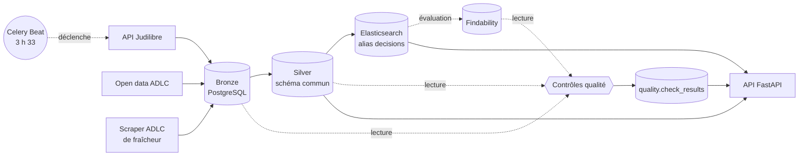

# legal-data-pipeline


Mini-pipeline de données juridiques : collecte multi-sources (API, open data, scraping), structuration, contrôle qualité, recherche et planification.


```mermaid
flowchart LR
    C((Celery Beat<br/>3 h 33)) -. déclenche .-> J
    J[API Judilibre] --> B[(Bronze<br/>PostgreSQL)]
    O[Open data ADLC] --> B
    W[Scraper ADLC<br/>de fraîcheur] --> B
    B --> S[(Silver<br/>schéma commun)]
    S --> E[(Elasticsearch<br/>alias decisions)]
    E -. évaluation .-> F[(Findability)]
    B -. lecture .-> Q{{Contrôles qualité}}
    S -. lecture .-> Q
    F -. lecture .-> Q
    Q --> R[(quality.check_results)]
    E --> A[API FastAPI]
    S --> A
    R --> A
```

## En bref
- **3 sources** : l'API Judilibre, l'open data et le site de l'Autorité de la concurrence.
- **8155 décisions** dans la couche Silver : 6687 de l'Autorité de la concurrence, 1468 de Judilibre.
- **13 contrôles qualité** sur 5 dimensions (complétude, validité, unicité, cohérence, fraîcheur), résultats historisés.
- **Un index Elasticsearch** reconstruit à chaque run, avec une évaluation de la trouvabilité : 100 % des décisions retrouvées par leur numéro, et 100 % des décisions au titre non ambigu retrouvées en 1ʳᵉ position par leur titre.
- **Une API FastAPI** en lecture seule : recherche plein texte ou par numéro, détail d'une décision, suivi des runs et des contrôles qualité.
- **Un pipeline planifié** avec Celery et Redis : chaque nuit à 3 h 33, toute la chaîne s'enchaîne et s'arrête à la première étape bloquante en échec.
- **441 tests**, sans appel réseau, lancés par la CI à chaque pull request.

> [!IMPORTANT]
> **Pourquoi ne pas tout automatiser ?**
> J'aurais pu confier l'ensemble du projet à Claude Code, en lui faisant rédiger un plan d'implémentation (par exemple avec les skills Superpowers) puis l'exécuter de bout en bout. J'ai fait le choix inverse : **garder la main sur chaque étape**, pour comprendre ce qui est construit, prendre moi-même les décisions liées aux sources et pouvoir expliquer chaque ligne de code. La délégation à un agent vient ensuite, progressivement, sur des tâches dont je maîtrise le contexte et que je sais vérifier.
>
> **Ce que cette approche a permis de trouver :**
> - la route `/export` de l'API Judilibre était **dépréciée**, alors que rien ne le signalait à l'exécution ;
> - la valeur par défaut de `date_type` **changeait silencieusement** entre `/export` et `/scan` : sur une même période, seules 6 décisions étaient communes aux deux routes ;
> - une décision peut être **modifiée sans que sa date de mise à jour change**, ce que seule la comparaison des empreintes a détecté ;
> - pour la couche Silver, **96 tests passaient, mais le premier run réel a révélé 6683 anomalies** : la spécification décrivait comme du texte des champs qui sont de vraies listes JSON. Vérifié avec `jsonb_typeof`, corrigé, et testé depuis sur de vraies décisions du Bronze ;
> - pour les contrôles qualité, une première version du contrôle de cohérence entre numéro et date levait **42 alertes, dont 39 fausses** : en examinant les décisions une par une, j'ai identifié une règle de la source (la numérotation d'une année se prolonge sur les premiers mois de la suivante) et isolé **les 3 vraies incohérences** ;
> - après la perte de la base lors d'une mise à jour de Podman, le pipeline s'est reconstruit à l'identique à partir des scripts, vérifié par les contrôles qualité ; la nouvelle collecte a révélé que **Judilibre publie des décisions avec plusieurs jours de retard**, sous une date de mise à jour passée : 16 décisions sur une fenêtre de deux jours le 23/09, 127 le 27/09 ;
> - le premier run planifié a fait ressortir un phénomène voisin à l'Autorité : **les décisions de concentration récentes arrivent sans texte**, leur version publique étant publiée plus tard. Le contrôle des textes vides accorde donc un délai de 90 jours, au lieu d'un seuil fixe qui aurait alerté chaque semaine.

## Objectif
- **Bronze** : collecter des décisions de justice et d'autorités administratives, stockées brutes dans PostgreSQL :
  - API Judilibre (Cour de cassation) ;
  - jeu de données open data de l'Autorité de la concurrence (data.gouv.fr) ;
  - scraper du site de l'Autorité de la concurrence, pour détecter les décisions pas encore publiées en open data.
- **Silver** : ramener les décisions de Judilibre et de l'open data à un schéma commun.
- **Qualité** : mesurer l'écart entre ce qui est collecté et ce qui est exploitable.
- **Recherche** : indexer les décisions dans Elasticsearch, mesurer leur trouvabilité et les exposer par une API FastAPI.
- **Orchestration** : planifier le pipeline avec Celery et Redis.
- **Supervision** : suivre les runs et la qualité dans le temps avec Grafana.

## Avancement
- [x] Étape 1a : collecteur Judilibre (pagination, reprises sur erreur, collecte incrémentale, journal des runs), testé sur données réelles ; idempotence vérifiée (relance d'un run : 0 nouveau, 14 inchangés)
- [x] Industrialisation : CI GitHub Actions (ruff + pytest), pre-commit, Dependabot, branche `main` protégée
- [x] Migration de `/export` (déprécié) vers `/scan`, avec `date_type` explicite
- [x] Étape 1b : ingestion du jeu de données open data de l'Autorité de la concurrence (6683 décisions, lecture en flux d'un JSON de 210 Mo, idempotence vérifiée)
- [x] Étape 1c : scraper de fraîcheur du site de l'Autorité de la concurrence (première page de la liste, contrôle des écarts avec l'open data), réalisé par délégation à un agent
- [x] Étape 2 : couche Silver (schéma commun Judilibre et Autorité de la concurrence, reconstruction complète à chaque run, 6707 décisions au premier run, aucune anomalie), réalisée par délégation à un agent
- [x] Étape 3 : contrôles qualité (9 contrôles sur 5 dimensions au départ, résultats historisés, écarts connus distingués des nouveaux) ; catalogue de requêtes écrit par moi, moteur réalisé par délégation à un agent
- [x] Étape 4 : recherche (index Elasticsearch avec bascule d'alias, évaluation de la trouvabilité, API FastAPI en lecture seule) ; mapping, conception de l'évaluation, poids du titre et contrat de l'API décidés par moi, implémentation réalisée par délégation à un agent
- [x] Étape 5 : planification du pipeline avec Celery et Redis (chaque nuit à 3 h 33, open data le lundi, fenêtre de recouvrement pour Judilibre, verrou, étapes bloquantes ou non) ; ordre de la chaîne, calendrier et règles d'échec décidés par moi, implémentation réalisée par délégation à un agent ; vérifié sur runs réels (run planifié, verrou, arrêt sur une étape en panne)
- [ ] Étape 6 : supervision du pipeline avec Grafana (runs, évolution des contrôles qualité, trouvabilité, volumes de l'index), tableaux de bord versionnés

## Lancer le projet
```bash
cp .env.example .env            # puis renseigner JUDILIBRE_API_KEY
docker compose up -d            # ou : podman compose up -d
pip install -r requirements-dev.txt
pre-commit install
pytest
python -m src.collector.judilibre.run --start 2026-09-01 --end 2026-09-07
python -m src.collector.adlc_opendata.run                 # fichier local : data/raw/adlc-texte-complet-publications.json
python -m src.collector.adlc_opendata.run --url <URL>     # ou téléchargement préalable depuis data.gouv.fr
python -m src.collector.adlc_scraper.run                  # contrôle de fraîcheur : décisions du site absentes de l'open data
python -m src.silver.run                                  # reconstruction complète de silver.decisions depuis Bronze
python -m src.search.run                                  # reconstruction de l'index decisions ; code de sortie 1 si l'alias n'est pas basculé
python -m src.search.evaluate                             # évaluation de la trouvabilité, résultats dans search.findability_*
python -m src.quality.run                                 # contrôles qualité ; code de sortie 1 si un contrôle bloquant échoue
uvicorn src.api.main:app                                  # API de recherche en lecture seule ; documentation : http://127.0.0.1:8000/docs
```

`compose up -d` démarre aussi le pipeline planifié : Redis, le worker Celery et Beat (voir [Planification](#planification)). Après une modification du code, reconstruire leur image avec `podman compose up -d --build`. Renseigner `ADLC_OPENDATA_URL` dans `.env` pour l'ingestion hebdomadaire de l'open data.

Les scripts de `sql/` ne sont exécutés qu'à la création du volume PostgreSQL. Sur une base existante, appliquer à la main les migrations Silver, qualité et recherche (PowerShell) :
```powershell
Get-Content sql\003_silver.sql | podman exec -i legal-data-pipeline-postgres-1 psql -U legal -d legal
Get-Content sql\004_quality.sql | podman exec -i legal-data-pipeline-postgres-1 psql -U legal -d legal
Get-Content sql\005_search.sql | podman exec -i legal-data-pipeline-postgres-1 psql -U legal -d legal
Get-Content sql\006_findability.sql | podman exec -i legal-data-pipeline-postgres-1 psql -U legal -d legal
```

Sous Windows, utiliser `127.0.0.1` plutôt que `localhost` dans `DATABASE_URL` et `ELASTICSEARCH_URL` : `localhost` est d'abord résolu en IPv6 (`::1`), et la connexion au conteneur peut alors prendre plus de deux minutes avant de se rabattre sur l'IPv4.

Sous Windows avec Podman (machine WSL) :
- prévoir au moins 4 Go de mémoire pour WSL (`memory` dans `%USERPROFILE%\.wslconfig`) : avec 2 Go, la machine Podman s'effondre au démarrage d'Elasticsearch ;
- la mise à jour de Podman 5 vers 6 a remplacé la machine, et avec elle les volumes de données. Sauvegarder la base avant toute mise à jour ; le pipeline se reconstruit ensuite entièrement à partir des scripts (vérifié le 27/09/2026 : mêmes résultats aux contrôles qualité).

Sauvegarder la base (le fichier reste dans `data/`, ignoré par Git) :
```powershell
podman exec legal-data-pipeline-postgres-1 pg_dump -U legal -d legal -Fc -f /tmp/legal.dump
podman cp legal-data-pipeline-postgres-1:/tmp/legal.dump data\legal.dump
```

Le dossier `data/` est ignoré par Git : les fichiers sources sont téléchargés, jamais versionnés.

Options du collecteur Judilibre : `--date-type update|creation` (défaut : `update`), `--batch-size` (défaut : 100), `--lookback-days N` (défaut : 14, ignoré avec `--start`). Sans `--start`, la collecte reprend N jours avant la fin du dernier run réussi du même type de date (avec `--lookback-days 0`, juste après), car des décisions apparaissent après coup avec une date de mise à jour passée (voir [Pièges des sources › Judilibre › Questions ouvertes](#judilibre-api-piste)) ; les décisions déjà connues sont comptées comme inchangées grâce aux empreintes.

## Structure du projet
```text
src/
├── collector/                # un collecteur par source, chacun avec son point d'entrée run.py
│   ├── judilibre/            # client de l'API Judilibre (pagination /scan, reprises sur erreur) et collecte incrémentale
│   ├── adlc_opendata/        # téléchargement et lecture en flux du JSON open data de l'Autorité de la concurrence
│   └── adlc_scraper/         # client HTTP, parseurs HTML de la liste des décisions et contrôle des écarts avec l'open data
├── storage/
│   └── bronze_store.py       # écriture dans Bronze (empreinte du contenu, idempotence) et journal des runs
├── silver/
│   ├── common.py             # schéma commun (SilverRow) et conversions partagées (dates, listes)
│   ├── judilibre.py          # transformation d'une décision Judilibre
│   ├── adlc_opendata.py      # transformation d'une décision de l'open data de l'Autorité
│   └── run.py                # reconstruction complète de silver.decisions et comptage des anomalies
├── quality/
│   ├── checks.yml            # catalogue des contrôles : requêtes SQL, attentes par source, sévérité
│   ├── checks.py             # chargement et validation du catalogue
│   ├── evaluate.py           # comparaison des résultats aux attentes, statuts et verdict
│   └── run.py                # exécution en lecture seule, historisation dans quality.check_results
├── search/
│   ├── mapping.json          # mapping de l'index : champs, analyseur français, normaliseur des numéros
│   ├── document.py           # construction d'un document à partir d'une ligne Silver
│   ├── index.py              # accès à Elasticsearch (création, envoi en masse, comptes, alias)
│   ├── rebuild.py            # reconstruction d'un index et bascule de l'alias si les comptes concordent
│   ├── run.py                # lecture de Silver, statistiques dans search.index_stats, rapport
│   ├── query.py              # requêtes par numéro et par titre, partagées avec l'API
│   ├── findability.py        # échantillon, ambiguïtés, rangs, métriques et rapport de l'évaluation
│   └── evaluate.py           # évaluation de la findability, résultats dans search.findability_*
├── api/
│   ├── main.py               # application FastAPI : routes, format unique des erreurs
│   ├── search.py             # corps de recherche autour de query.py (filtres, pagination, surlignage)
│   ├── backends.py           # Elasticsearch et PostgreSQL en lecture seule, indisponibilité en 503
│   ├── models.py             # modèles des réponses, repris dans la documentation /docs
│   └── display.py            # titre d'affichage des décisions sans titre (citation Judilibre)
└── pipeline/
    ├── app.py                # application Celery : broker Redis, fuseau Europe/Paris, un processus par étape
    ├── schedule.py           # planification de Beat (03:33, heure de Paris) et prochaine exécution
    ├── steps.py              # étapes (script, bloquante ou non, réseau ou non) et appel de leur point d'entrée
    ├── tasks.py              # tâches : déclenchement, chaîne des étapes, retries, fin du run
    ├── lock.py               # verrou Redis : un seul run du pipeline à la fois
    ├── runlog.py             # journal des runs du pipeline dans bronze.collection_runs
    └── trigger.py            # déclenchement manuel et affichage de la prochaine exécution
sql/
├── 001_bronze.sql            # schéma bronze : documents bruts et journal des runs
├── 002_add_date_type.sql     # type de date filtré (update | creation) dans le journal des runs
├── 003_silver.sql            # schéma silver : table decisions
├── 004_quality.sql           # schéma quality : table check_results
├── 005_search.sql            # schéma search : table index_stats
└── 006_findability.sql       # schéma search : tables findability_runs et findability_results
tests/
├── fixtures/                 # page HTML et extrait JSON, pour tester sans appel réseau
└── test_*.py                 # un fichier par module (collecteurs, Silver, qualité, recherche, API, pipeline)
docs/
├── api/                      # copie de référence de la spécification OpenAPI de Judilibre
├── sources/                  # analyse des sources (structure des données, écarts constatés)
└── tasks/                    # spécifications des tâches déléguées à un agent
Dockerfile                    # image du worker et de Beat : Python 3.12 slim, utilisateur non root
.dockerignore                 # seuls requirements.txt et src/ entrent dans l'image (ni .env, ni data/)
```

## Couche Silver
Une seule table, `silver.decisions`, alimentée par Judilibre et l'open data de l'Autorité de la concurrence (le scraper reste un outil de contrôle, hors Silver) :
- un **tronc commun** : numéro, émetteur, type, date, titre, texte intégral, secteurs, URL ;
- une colonne **`attributes`** (JSON) pour les champs propres à chaque source.

Règles de transformation :
- **reconstruction complète** à chaque run, dans une seule transaction : en cas d'échec, l'ancien contenu reste intact ;
- **ne jamais deviner** : une valeur non convertible devient `NULL` et est comptée comme anomalie, par type ; une valeur inconnue n'est jamais rattachée à un type connu ;
- **un champ absent n'est pas une anomalie** : les deux familles de décisions de l'Autorité n'ont pas les mêmes champs ;
- **pas de dédoublonnage** en Silver : les doublons restent visibles pour l'étape des contrôles qualité.

Le run est journalisé dans `bronze.collection_runs` (source `silver`). Spécification et plan : [`docs/tasks/`](docs/tasks/).

## Contrôles qualité
Chaque contrôle est une requête SQL associée à une attente, déclarée dans [`src/quality/checks.yml`](src/quality/checks.yml). Je tiens ce catalogue moi-même (requêtes et seuils) ; le moteur (`src/quality/`) se contente de les exécuter.

- Chaque requête renvoie une ligne par source, avec deux colonnes : `source` et `value`.
- Les attentes (`==`, `<=`, `>=`, `<`, `>`) sont données par source, avec une entrée `default` facultative. Un **écart connu et documenté** a sa propre attente (par exemple 25 décisions anciennes de l'Autorité sans texte) : il ne déclenche pas d'alerte, alors qu'un nouvel écart ressort.
- Statuts d'un résultat :
  - `pass` / `fail` : la valeur respecte ou non l'attente ;
  - `no_data` : une source déclarée dans l'attente est absente du résultat ;
  - `unchecked` : aucune attente ne s'applique à la source (signalé, jamais bloquant) ;
  - `query_error` : la requête a échoué ou son résultat est mal formé ; les autres contrôles s'exécutent quand même.
- **Verdict** : le run échoue si un contrôle de sévérité `error` est en `fail`, `no_data` ou `query_error`. Le script sort alors avec le code 1 (0 sinon), pour que Celery ou la CI puissent arrêter le pipeline. Un contrôle `warning` n'est jamais bloquant.

Les requêtes s'exécutent dans une transaction en lecture seule, avec un savepoint par contrôle. Les résultats sont ensuite stockés dans `quality.check_results` (une ligne par contrôle et par source, avec le message d'erreur d'un `query_error`), pour suivre la qualité dans le temps. Le run est journalisé dans `bronze.collection_runs` (source `quality`) : son statut est `success` dès que le moteur a tout exécuté, quel que soit le verdict.

L'option `--checks <chemin>` permet de lancer un autre catalogue, par exemple un catalogue de test avec une requête volontairement cassée.

**Premier run (25/09/2026)** : 9 contrôles, 18 résultats, tous `pass`. Écarts connus, acceptés à leur niveau actuel : 30 décisions de l'Autorité sans texte intégral, 5 numéros en double, 3 dates impossibles au regard du numéro, et le type de décision vide pour toutes les décisions de Judilibre.

**Au 26/09/2026** : 12 contrôles, 24 résultats, tous `pass`, dont la complétude et la fraîcheur de l'index, et sa trouvabilité (100 % par numéro, 100 % en 1ʳᵉ position par titre hors titres ambigus).

**Au 27/09/2026**, après la reconstruction complète du pipeline sur une base neuve : les mêmes 24 résultats, tous `pass`, avec exactement les mêmes écarts connus. Depuis, `duplicate_decision_number` ne porte plus que sur l'Autorité, et `duplicate_ecli` contrôle l'unicité des décisions Judilibre : un numéro de pourvoi identifie une affaire, pas une décision (13 contrôles, 24 résultats, tous `pass`).

**Au 28/09/2026**, le premier run planifié a fait passer `empty_text` de 30 à 32 : deux nouvelles décisions de concentration, arrivées sans texte. Le contrôle ne compte désormais que les décisions de plus de 90 jours (25 connues) : une décision récente sans texte n'alerte plus, mais si son texte n'arrive toujours pas 90 jours plus tard, elle entre dans le comptage et le contrôle alerte.

## Recherche
Les décisions de Silver sont indexées dans Elasticsearch (service `elasticsearch` du `docker-compose.yml`, un seul nœud, sécurité désactivée : usage local uniquement). Le mapping, dans [`src/search/mapping.json`](src/search/mapping.json), est strict : un champ non déclaré fait rejeter le document.

- **Reconstruction complète** à chaque run, dans un nouvel index `decisions_<AAAAMMJJ_HHMMSS>` (heure UTC). Un document par ligne Silver, d'identifiant `source|external_id` ; une valeur `NULL` reste `null`, et `has_text` indique si le texte intégral est présent.
- **Bascule atomique** : l'alias `decisions`, seul nom interrogé, passe au nouvel index en une seule opération, **uniquement si** les comptes par source sont identiques à ceux de Silver et qu'aucun document n'a été rejeté. Silver est compté et lu sur un même instantané, en lecture seule.
- **En cas d'écart ou d'erreur**, le nouvel index est supprimé et l'alias reste sur l'ancien : la recherche ne voit jamais un index incomplet.
- **Retour arrière** : après la bascule, l'index précédent est conservé et les plus anciens sont supprimés. Un échec de ce nettoyage est signalé par un avertissement, sans changer le code de sortie.

Chaque run écrit dans `search.index_stats` une ligne par source (compte Silver, compte indexé, rejets, bascule ou non), même quand l'alias n'est pas basculé. Il est journalisé dans `bronze.collection_runs` (source `search`) : statut `failed`, avec la raison dans `error`, si l'alias n'est pas basculé. Le script sort alors avec le code 1 (0 sinon).

### Évaluation de la findability
`python -m src.search.evaluate [--title-boost 1 2 3]` mesure si les décisions de Silver se retrouvent dans l'index, sur un échantillon reproductible. Spécification : [`docs/tasks/index-quality.md`](docs/tasks/index-quality.md).

- **Échantillon** : 200 décisions de l'Autorité tirées par `md5(external_id)`, plus toutes celles sans texte intégral, toutes celles dont le numéro est partagé et toutes les décisions de Judilibre.
- **Deux modes**, via l'alias `decisions`, dans le top 10 :
  - `number` : recherche exacte sur le numéro, pour toutes les décisions de l'échantillon ;
  - `title` : le titre de la décision comme texte de recherche, sur le titre pondéré (`--title-boost`, 2 par défaut, décimales acceptées) et le texte intégral ; décisions de l'Autorité seulement (Judilibre n'a pas de titre). La requête est celle de [`src/search/query.py`](src/search/query.py), que l'API de recherche utilise.
- **Métriques** : hit@1, hit@10 et MRR (moyenne de 1/rang, 0 hors du top 10), au total et par groupe : texte présent ou non, titre ambigu ou non, numéro ambigu ou non. Un titre est ambigu s'il appartient à plusieurs décisions de Silver (espaces autour ignorés, apostrophes `’` et `'` confondues comme à l'indexation) ; un numéro, s'il est partagé (casse ignorée, comme le normaliseur de l'index). Un groupe vide n'a pas de métriques (`NULL` en base, « - » dans le rapport).
- **Stockage** : une ligne par mode et par poids du titre dans `search.findability_runs`, une ligne par décision cherchée (rang, `NULL` hors du top 10, et nombre de résultats) dans `search.findability_results`.
- **Rapport** : métriques par mode, poids et groupe, puis les décisions absentes du top 10 par numéro et par titre, avec leur rang pour chaque poids.

Le run est journalisé dans `bronze.collection_runs` (source `search-eval`). Il échoue si l'alias `decisions` est absent, ou s'il bascule vers un autre index pendant l'évaluation (les résultats mélangeraient deux index). Sinon, le script sort avec le code 0 : les seuils relèvent des contrôles qualité.

**Poids du titre : 2.** Mesuré sur l'échantillon (évaluation du 26/09/2026) : le poids 1 donne une 1ʳᵉ position pour 93,8 % des décisions par titre, les poids 2 et 3 pour 96,3 %, avec des résultats identiques dans tous les groupes. À résultat égal, le plus petit poids est retenu : l'évaluation utilise le titre complet comme requête, ce qui favorise le titre, alors qu'une recherche réelle de quelques mots se trouvera souvent dans le texte. Les décisions perdant la 1ʳᵉ position sont toutes des décisions au titre ambigu (82 titres partagés par 183 décisions dans Silver) : les 223 décisions de l'échantillon au titre non ambigu sont toutes retrouvées en 1ʳᵉ position. Limite connue : cette évaluation mesure la capacité à retrouver une décision dont on connaît le titre, pas la pertinence de recherches libres.

## API
Une API FastAPI en lecture seule expose l'index, la couche Silver, les runs et les contrôles qualité. Elle lit `DATABASE_URL` et `ELASTICSEARCH_URL` (voir `.env.example`) et refuse de démarrer si l'une manque.

```bash
uvicorn src.api.main:app        # http://127.0.0.1:8000/docs : documentation interactive
```

| Route | Rôle |
|---|---|
| `GET /` | redirige vers `/docs` (hors documentation OpenAPI) |
| `GET /search?q=...` | recherche plein texte : la requête évaluée de [`src/search/query.py`](src/search/query.py) (titre pondéré 2, texte intégral), extraits surlignés |
| `GET /search?number=...` | recherche par numéro exact (casse et accents ignorés), exclusive de `q`, sans surlignage |
| `GET /decisions/{source}?id=...` | détail d'une décision, lu dans `silver.decisions` ; `detail_path` de chaque résultat de recherche |
| `GET /runs` | derniers runs du pipeline (`bronze.collection_runs`), filtrables par source et statut |
| `GET /quality/latest` | résultats du dernier run des contrôles qualité, avec leur verdict |
| `GET /health` | état de PostgreSQL et d'Elasticsearch (alias `decisions` compris) ; 503 si l'un est en panne |

- **Filtres de recherche** (`source`, `decision_type`, `date_from`, `date_to`, `sector`, répétables sauf les dates) et **pagination** (`page`, `page_size` ≤ 50) sont ajoutés autour de la requête évaluée, sans la réécrire ni changer les scores.
- **Titre d'affichage** : les décisions Judilibre n'ont pas de titre ; l'API construit une citation (`Cour de cassation, 16 septembre 2026, n° 25-13.603`), jamais stockée.
- **Erreurs** : un format unique, `{"error": {"code", "message", "details"}}` ; 422 pour un paramètre invalide, 404 pour une décision absente, 503 si Elasticsearch ou PostgreSQL ne répond pas (chaque route ne dépend que de son service).

Contrat détaillé (paramètres, réponses, erreurs) : [`docs/tasks/search-api-contract.md`](docs/tasks/search-api-contract.md).

## Planification
Le pipeline complet tourne chaque nuit avec Celery et Redis, dans des conteneurs (le worker Celery ne fonctionne pas sous Windows). Les scripts existants sont appelés tels quels. Spécification : [`docs/tasks/celery-pipeline.md`](docs/tasks/celery-pipeline.md).

- **Services** du `docker-compose.yml` : `redis` (broker, aucun port publié sur l'hôte), `worker` (une étape à la fois, chacune dans un processus neuf) et `beat` (planificateur), construits à partir du `Dockerfile`. Dans Compose, les services se joignent par leur nom (`postgres:5432`, `elasticsearch:9200`, `redis:6379`) ; les scripts lancés depuis Windows gardent `127.0.0.1`. `JUDILIBRE_API_KEY` et `ADLC_OPENDATA_URL` viennent de `.env` ; `data/` est monté dans le worker.
- **Horaire** : chaque nuit à **3 h 33, heure de Paris**. Le fuseau `Europe/Paris` est déclaré explicitement : l'horaire suit les changements d'heure, et 3 h 33 est hors de la plage 2 h-3 h où ils ont lieu.
- **Exécution manquée** : si le worker et Beat ne tournent pas à 3 h 33 (ordinateur éteint), Beat lance l'exécution manquée dès son redémarrage, une seule fois même après plusieurs nuits (observé le 28/09/2026 : run `nightly` lancé à 11 h 57).
- **Open data, une fois par semaine, la nuit du lundi** : le fichier est publié le dimanche vers 10 h (horodatage `20260927-100049` dans son URL directe) ; la nuit du lundi récupère donc le plus récent.

| | Étape | Script | Si elle échoue |
|---|---|---|---|
| 1 | `adlc-opendata`, **le lundi seulement** | `src.collector.adlc_opendata.run --url $ADLC_OPENDATA_URL` | la chaîne continue |
| 2 | `judilibre` | `src.collector.judilibre.run` (fenêtre incrémentale, recouvrement de 14 jours) | la chaîne s'arrête |
| 3 | `adlc-scraper` | `src.collector.adlc_scraper.run` | la chaîne continue |
| 4 | `silver` | `src.silver.run` | la chaîne s'arrête |
| 5 | `search` | `src.search.run` | la chaîne s'arrête |
| 6 | `search-eval` | `src.search.evaluate` | la chaîne s'arrête |
| 7 | `quality` | `src.quality.run` | la chaîne s'arrête |

Règles :
- **Échec d'une étape** : une exception ou un code de sortie non nul. Un index dont l'alias n'est pas basculé (`search`) ou un verdict qualité en échec (`quality`) font donc échouer le run du pipeline.
- **Étape bloquante en échec** : la chaîne s'arrête, et le run du pipeline passe en `failed`, avec le nom de l'étape dans `error`.
- **Étape non bloquante en échec** (open data, scraper) : la chaîne continue et le run du pipeline finit en `success`, **avec une note dans `error`** : `non-blocking step failed: adlc-scraper` (plusieurs étapes : `non-blocking steps failed: adlc-opendata, adlc-scraper`). Un échec qui dure est signalé par le contrôle de fraîcheur `hours_since_last_success` (168 h).
- **Open data** : sans `ADLC_OPENDATA_URL`, l'étape échoue avec un message explicite ; le fichier local n'est jamais réingéré en silence.
- **Retries** : seulement pour les étapes réseau (open data, Judilibre, scraper), sur une erreur de connexion ou un délai dépassé : 3 au plus, après 60, 120 puis 240 secondes, en plus des 5 tentatives des clients HTTP. Aucun retry pour Silver, l'index, l'évaluation et la qualité : un échec s'y examine, il ne se répète pas. Chaque tentative d'un collecteur a son propre run.
- **Verrou** : un verrou Redis empêche deux runs simultanés. Un run déclenché pendant un autre est journalisé en `skipped` (`error` : `lock held by pipeline run <id>`) et rien n'est exécuté. Le worker ne traitant qu'une tâche à la fois, ce déclenchement est examiné à la fin de l'étape en cours.
- **Worker arrêté en cours de run** : l'étape interrompue n'est pas rejouée, le run du pipeline reste `running`, et le verrou expire au bout de 6 heures.

**Vérifié sur runs réels (28/09/2026)** : un run planifié rattrapé au redémarrage (`nightly`, open data compris), un second déclenchement pendant un run journalisé en `skipped` (`lock held by pipeline run 38`), et, avec Elasticsearch arrêté, une chaîne arrêtée à l'indexation (run `failed`, `error` : `search`), sans évaluation ni contrôles qualité. Une chaîne complète dure moins de 3 minutes.

Déclenchement manuel, depuis Windows (Redis n'étant pas exposé, la commande s'exécute dans le worker) :
```powershell
podman exec legal-data-pipeline-worker-1 python -m src.pipeline.trigger                  # chaîne complète, sans l'open data
podman exec legal-data-pipeline-worker-1 python -m src.pipeline.trigger --with-opendata  # avec l'open data en tête
podman exec legal-data-pipeline-worker-1 python -m src.pipeline.trigger --next-run       # prochaine exécution planifiée
podman logs -f legal-data-pipeline-worker-1                                               # suivre le run
```

Chaque run du pipeline est journalisé dans `bronze.collection_runs` : source `pipeline`, `date_type` `nightly` ou `manual`, statut `success`, `failed` ou `skipped`. Chaque étape y garde aussi son propre run. Les derniers runs du pipeline :
```powershell
podman exec legal-data-pipeline-postgres-1 psql -U legal -d legal -P pager=off -c "SELECT run_id, date_type, status, error, started_at, finished_at FROM bronze.collection_runs WHERE source = 'pipeline' ORDER BY run_id DESC LIMIT 10"
```
L'API les expose aussi : `GET /runs?source=pipeline` (filtre `status=skipped` accepté).

## Méthode de travail
Le projet est développé avec l'aide de l'IA générative, selon deux modes :

- **Assistance conversationnelle (Claude)** : explications, discussions de conception, premières versions de code (dont les requêtes SQL des contrôles qualité) que je relis, teste sur les données réelles et adapte.
- **Délégation à un agent (Claude Code)**, par exemple pour le scraper de fraîcheur ([PR #18](https://github.com/Maeva-RODRIGUES/legal-data-pipeline/pull/18)), la couche Silver ([PR #19](https://github.com/Maeva-RODRIGUES/legal-data-pipeline/pull/19)), le moteur des contrôles qualité ([PR #20](https://github.com/Maeva-RODRIGUES/legal-data-pipeline/pull/20)), l'index Elasticsearch ([PR #22](https://github.com/Maeva-RODRIGUES/legal-data-pipeline/pull/22)), l'évaluation de la trouvabilité ([PR #28](https://github.com/Maeva-RODRIGUES/legal-data-pipeline/pull/28)), l'API de recherche ([PR #30](https://github.com/Maeva-RODRIGUES/legal-data-pipeline/pull/30)), la fenêtre de recouvrement de Judilibre ([PR #32](https://github.com/Maeva-RODRIGUES/legal-data-pipeline/pull/32)) et la planification Celery ([PR #33](https://github.com/Maeva-RODRIGUES/legal-data-pipeline/pull/33)) : je rédige une spécification (contexte, contraintes, critères de réussite) dans [`docs/tasks/`](docs/tasks/), l'agent propose un plan que je relis et corrige, puis produit le code et les tests sur une branche, et je valide avant toute fusion. Les conventions données à l'agent sont dans [`CLAUDE.md`](CLAUDE.md).

**Ce qui reste de mon ressort :**
- l'analyse de chaque source (documentation, `robots.txt`, structure des données) et les choix de conception qui en découlent ;
- le catalogue des contrôles qualité : chaque requête testée et chaque seuil calibré sur les données réelles ;
- la relecture des plans et du code, les runs sur données réelles et la vérification des résultats ;
- la documentation des pièges rencontrés, notés ci-dessous.

Chaque pull request précise ce qui a été délégué et ce que j'ai fait ou corrigé moi-même.

## Pièges des sources

### Judilibre (API PISTE)
Spécification de référence : [`docs/api/`](docs/api/).

**Observé lors du premier run** (15-16 septembre 2026 : 14 décisions collectées) :
- La décision est renvoyée complète (31 champs), texte intégral compris (`text`) et découpage du texte en parties (`zones`) : pas besoin d'un appel supplémentaire par décision.
- Chaque date existe en deux versions (`decision_date` / `decision_datetime`, `update_date` / `update_datetime`) : leur cohérence reste à contrôler.

**D'après la spécification Swagger :**
- `GET /export` est marqué comme déprécié. Son remplaçant, `GET /scan`, accepte les mêmes filtres mais pagine avec un curseur au lieu d'un numéro de lot, ce qui convient mieux aux gros volumes.
- Sans paramètre `jurisdiction`, seules les décisions de la Cour de cassation (`cc`) sont renvoyées ; les cours d'appel (`ca`) et tribunaux judiciaires (`tj`) doivent être demandés explicitement.
- `batch_size` vaut 10 par défaut, 1000 au maximum.
- `GET /transactionalhistory` liste les créations, mises à jour et **suppressions** de décisions : la couche Bronze ne détecte pas encore les décisions retirées.

**Observé lors de la migration vers `/scan` :**
- Le curseur de pagination s'appelle `searchAfter` dans la réponse (et non `search_after` comme dans la documentation) et il est fourni dans `next_batch` sous forme de paramètres d'URL. Le collecteur le renvoie tel quel, sans le reconstruire.
- **La valeur par défaut de `date_type` diffère entre les deux endpoints**, et la documentation ne la précise pas. Sur la même période (15-16/09/2026) :
  - `/export` sans `date_type` : 14 décisions, filtrées sur la **date de décision** (identique à `date_type=creation`) ;
  - `/scan` sans `date_type` : 16 décisions, filtrées sur la **date de mise à jour** (identique à `date_type=update`) ;
  - seules 6 décisions sont communes aux deux ensembles.
- Conséquence : migrer sans `date_type` explicite change silencieusement le périmètre de la collecte. Le collecteur envoie désormais toujours `date_type` (`update` par défaut, pour ne pas manquer les décisions publiées tardivement, dont une rendue en 2021 et mise à jour le 16/09/2026), et le journal des runs l'enregistre.

**Observé lors de la conception de la couche Silver :**
- **`number` est corrompu** : il concatène le premier numéro de pourvoi et tous les autres, sans séparateur ni ponctuation (par exemple `26-83.1462280984` pour `26-83.146` et `22-80.984`). Le numéro fiable est le premier élément de `numbers`, qui contient lui-même des doublons (jusqu'à 15 entrées pour 5 numéros distincts).
- `type` vaut `other` pour toutes les décisions collectées : le type de décision reste vide en Silver plutôt que d'être deviné.
- `summary` est souvent vide : il ne peut pas servir de titre.
- L'URL publique d'une décision est `https://www.courdecassation.fr/decision/{id}` (vérifié le 25/09/2026).
- Les textes sont **pseudonymisés** : noms et adresses des personnes physiques remplacés par des marqueurs (`M. [R] [T]`, `[Adresse 1]`) ; magistrats, avocats et personnes morales restent nommés.
- **Un numéro de pourvoi n'identifie pas une décision** : une même affaire peut produire plusieurs décisions, par exemple une décision sur une QPC et l'arrêt sur le fond le même jour, ou un renvoi puis un arrêt de chambre mixte (5 cas sur 1468 décisions le 27/09/2026). L'identifiant d'une décision est l'ECLI ; les contrôles d'unicité portent donc sur l'ECLI pour Judilibre.

**Questions ouvertes :**
- Certaines décisions ont un contenu différent selon qu'elles sont obtenues par `/export` ou par `/scan`, ou ont été mises à jour entre deux runs. La couche Bronze écrasant l'ancienne version, la différence ne peut pas être analysée : piste pour une Bronze en append-only (historique des versions).
- Le contenu d'une décision peut changer **sans que sa date de mise à jour change** : observé le 24/09/2026 sur une décision datée du 15/09, dont le contenu renvoyé par `/scan` avait été modifié. Seule la comparaison des empreintes (hash du contenu complet) l'a détecté ; une détection fondée sur `update_date` l'aurait manqué.
- Une décision peut sortir d'une fenêtre de collecte après coup, si elle est remise à jour : un run relancé sur une période passée ne renvoie pas toujours le même ensemble. La collecte incrémentale la récupère dans la fenêtre de sa nouvelle date de mise à jour.
- **Des décisions apparaissent après coup avec une date de mise à jour passée** : la fenêtre des mises à jour du 15 au 16/09/2026 renvoyait 16 décisions le 23/09, et 127 le 27/09 (dont 122 mises à jour le 16/09, et 124 rendues en septembre 2026). Des décisions récentes deviennent donc visibles dans l'API plusieurs jours après la date de mise à jour qui leur est attribuée : une collecte incrémentale qui reprend strictement après le dernier run les manquerait, sans erreur. Mis en place : le collecteur reprend 14 jours avant la fin du dernier run (`--lookback-days`) ; un double run le 27/09/2026 a relu 1031 décisions sans aucun doublon.

### Autorité de la concurrence (open data)
Documentation détaillée : [`docs/sources/autorite-concurrence.md`](docs/sources/autorite-concurrence.md).

- `id_decision` n'est pas unique (5 doublons) : l'identifiant retenu est l'URL de la décision. Vérifié en base : 6683 documents pour 6678 `id_decision` distincts.
- `type_decision` mélange libellés, codes et listes (type principal + sous-type : `MC`, `DEX`, `SOA`). Les listes sont du texte au format Python dans le CSV, mais de vraies listes JSON dans le JSON : un affichage trompeur a d'abord fait croire le contraire, et seul le premier run réel de la couche Silver l'a révélé.
- Deux familles de schémas (décisions/avis et concentrations), plus un cas limite à 20 champs (la lettre du ministre de l'économie, dont le libellé contient une faute de frappe) : en Silver, le tronc commun est complété par une colonne `attributes`.
- `decision_simplifiee` vaut `null` pour 28 décisions : 27 des 28 décisions `DEX` et la lettre du ministre. Une seule décision `DEX` a une valeur : ce n'est donc pas une règle stricte.
- **Des décisions n'ont pas de texte intégral** (chaîne vide), et ne peuvent donc pas être retrouvées par une recherche dans leur contenu : 32 le 28/09/2026. Les plus récentes sont des décisions de concentration de septembre 2026 (`26-DCC-182` à `26-DCC-188`) : leur version publique est publiée après la décision. Le contrôle `empty_text` ne compte donc que les décisions de plus de 90 jours (25, surtout des documents des années 1990 et d'anciennes décisions de concentration).
- **La numérotation d'une année se prolonge sur les premiers mois de la suivante** (39 décisions, par exemple `00-D-68` à `00-D-92`, datées de janvier à mars 2001) : ce n'est pas une erreur. En revanche, **3 décisions ont une date impossible**, antérieure à l'année de leur numéro : `95-MC-06` (1990), `95-D-26` (1992) et `96-D-03` (1995).
- **82 titres sont partagés par 183 décisions** (en confondant les apostrophes `'` et `’`) : une recherche par titre ne peut pas les distinguer. Les 5 paires de décisions publiées deux fois partagent à la fois leur numéro et leur titre.
- Le `robots.txt` du site interdit toutes les URL avec paramètres, dont la pagination de la liste : l'historique vient donc de l'open data, et le scraper de fraîcheur ne visite que la première page de la liste (une seule requête par run).
- Les URL de la liste correspondent exactement au champ `url_site` de l'open data : elles servent de clé de comparaison entre le site et le jeu de données (vérifié sur les 20 décisions de la première page, toutes présentes dans l'open data le 25/09/2026).
- **Le jeu de données est mis à jour chaque semaine, le dimanche vers 10 h** (horodatage `20260927-100049` dans l'URL directe du fichier) : l'ingestion planifiée a donc lieu la nuit du lundi.
